# Ceiling Fan Direction Control Blueprint Documentation

## Overview
The Ceiling Fan Direction Control Blueprint provides a safe and automated way to change ceiling fan motor direction using a Shelly Plus 2PM Gen4 relay configured in cover/roller mode. This blueprint coordinates the fan controller and polarity-reversal relay to prevent motor damage during direction changes.

This blueprint is designed for ceiling fans with reversible motors where you want to switch between:
- **Forward (Summer)**: Pushes air downward for cooling effect
- **Reverse (Winter)**: Pulls air upward to circulate warm air

## Purpose
This blueprint safely manages fan direction changes by:
- Ensuring the fan is completely OFF before changing motor polarity
- Providing configurable safety delays for motor and relay settling
- Coordinating fan controllers with external polarity-reversal relays
- Preventing overlapping direction changes that could damage equipment
- Sending notifications when direction changes are complete

## Safety Features

### Motor Protection
- **Automatic Fan Shutdown**: Always turns fan OFF before changing direction
- **Motor Stop Delay**: Configurable wait time (default 10s) for motor to fully stop
- **Single Mode Execution**: Prevents multiple simultaneous direction changes

### Relay Protection
- **Relay Settle Delay**: Configurable wait time (default 3s) after relay switches
- **Electrical Isolation**: Shelly relay in cover mode provides safe polarity reversal
- **State-Based Control**: Cover position maps to motor polarity direction

### User Safety
- **Notifications**: Alerts when direction change starts and completes
- **Status Tracking**: Input select shows current fan direction setting
- **Manual Override**: User can change direction via dashboard at any time

## Configuration Inputs

### Required Inputs

#### 1. Ceiling Fan Entity
- **Type**: `fan.*` entity
- **Purpose**: The fan controller that will be turned OFF during direction changes
- **Examples**:
  - `fan.bedroom_ceiling_fan`
  - `fan.theater_ceiling_fan_north`
  - `fan.living_room_fan`
- **Supported Controllers**: Z-Wave fan controllers, Zigbee fans, or any fan entity

#### 2. Direction Relay (Shelly Cover)
- **Type**: `cover.*` entity
- **Purpose**: Shelly Plus 2PM Gen4 configured in roller/cover mode for polarity reversal
- **Configuration**:
  - `cover.open_cover` = Forward (Summer) - downward airflow
  - `cover.close_cover` = Reverse (Winter) - upward airflow
- **Examples**:
  - `cover.bedroom_fan_direction`
  - `cover.theater_fan_north_direction`
  - `cover.living_room_fan_reverse`

**IMPORTANT**: The Shelly must be configured in **ROLLER/COVER mode**, not switch mode. This provides the relay interlock needed for safe motor polarity reversal.

#### 3. Direction Selector (Input Select Helper)
- **Type**: `input_select.*` entity
- **Purpose**: Tracks and controls the desired fan direction
- **Required Options**:
  - `Forward (Summer)`
  - `Reverse (Winter)`
- **Examples**:
  - `input_select.bedroom_fan_direction`
  - `input_select.theater_fan_north_direction`

See **Input Select Helper Setup** section below for creation instructions.

### Optional Inputs

#### 4. Notification Targets
- **Type**: `notify.*` services (multiple allowed)
- **Purpose**: Send alerts when direction change starts and completes
- **Default**: Empty (no notifications)
- **Examples**:
  - `notify.mobile_app_iphone`
  - `notify.mobile_app_android`
  - `notify.persistent_notification`

#### 5. Motor Stop Delay
- **Type**: Number (seconds)
- **Purpose**: Time to wait after turning fan OFF before changing relay
- **Default**: 10 seconds
- **Range**: 5-30 seconds
- **Recommendation**: Use minimum 10 seconds for ceiling fan motors
- **Increase if**: You hear clicking, grinding, or buzzing during direction changes

#### 6. Relay Settle Delay
- **Type**: Number (seconds)
- **Purpose**: Time to wait after relay switches before allowing fan operation
- **Default**: 3 seconds
- **Range**: 1-10 seconds
- **Recommendation**: Use minimum 3 seconds for Shelly Plus 2PM Gen4

#### 7. Enable Notifications
- **Type**: Boolean (toggle)
- **Purpose**: Enable or disable notification messages
- **Default**: True (enabled)
- **Use Cases**: Disable for silent operation, enable for user feedback

## Input Select Helper Setup

Before using this blueprint, you must create an `input_select` helper for each fan to track direction.

### Steps to Create Helper (via UI)
1. Go to **Settings → Devices & Services → Helpers**
2. Click **"Create Helper"** → **"Dropdown"**
3. Configure:
   - **Name**: "Bedroom Fan Direction" (or your preference)
   - **Icon**: `mdi:fan` (optional)
   - **Options**: Add exactly two options:
     - `Forward (Summer)`
     - `Reverse (Winter)`
   - **Initial Value**: `Forward (Summer)`
4. Click **"Create"**

### YAML Configuration (Alternative Method)

Add this to your `configuration.yaml` or `input_select.yaml`:

```yaml
input_select:
  bedroom_fan_direction:
    name: Bedroom Fan Direction
    options:
      - Forward (Summer)
      - Reverse (Winter)
    initial: Forward (Summer)
    icon: mdi:fan

  theater_fan_north_direction:
    name: Theater Fan North Direction
    options:
      - Forward (Summer)
      - Reverse (Winter)
    initial: Forward (Summer)
    icon: mdi:fan

  theater_fan_south_direction:
    name: Theater Fan South Direction
    options:
      - Forward (Summer)
      - Reverse (Winter)
    initial: Forward (Summer)
    icon: mdi:fan
```

**IMPORTANT**: The options must be **exactly** as shown (case-sensitive):
- ✅ `Forward (Summer)` and `Reverse (Winter)`
- ❌ `forward`, `summer`, `Forward`, `Summer Mode`, etc.

After adding YAML configuration, restart Home Assistant for changes to take effect.

## How It Works

### Trigger
The automation is triggered when the **direction selector** (`input_select`) state changes. This happens when:
- User changes direction via dashboard
- Another automation changes the input_select
- Voice assistant changes the selection

### Safety Check (Condition)
Before executing, the automation verifies that the direction **actually changed** (not just a refresh or reload). This prevents unnecessary motor cycling.

### Action Sequence

#### 1️⃣ Turn Off Fan (Safety First)
```yaml
- Turn OFF the ceiling fan entity
- Ensures motor stops spinning before polarity reversal
```

#### 2️⃣ Optional Notification (Direction Change Started)
```yaml
- Send notification (if enabled and targets configured)
- Alerts user that direction change is in progress
- Shows new direction setting
```

#### 3️⃣ Wait for Motor to Stop (Safety Delay)
```yaml
- Wait configured motor_stop_delay (default 10 seconds)
- Allows motor to fully stop spinning
- Prevents mechanical stress on motor windings
```

#### 4️⃣ Change Relay Direction (Polarity Reversal)
```yaml
- If "Reverse (Winter)": Close cover (reverse polarity)
- If "Forward (Summer)": Open cover (normal polarity)
- Shelly relay switches motor wire polarity
```

#### 5️⃣ Wait for Relay to Settle (Safety Delay)
```yaml
- Wait configured relay_settle_delay (default 3 seconds)
- Allows relay contacts to fully engage
- Ensures stable electrical connection
```

#### 6️⃣ Notify User (Direction Change Complete)
```yaml
- Send notification (if enabled and targets configured)
- Alerts user that fan is safe to turn on
- Shows completed direction setting
```

### Execution Mode
**Mode: Single** - Only one direction change can run at a time. If a new direction change is requested while one is in progress, it will wait until the current change completes before starting.

## Advanced: Optional Safety Blocking Automation

For additional safety, you can create a second automation that **prevents the fan from being turned ON** while a direction change is in progress.

### When to Use This
- If you have physical wall switches that can override Home Assistant
- If multiple users/automations control the fan
- If you want absolute protection against accidental fan activation during direction changes

### YAML Configuration

Add this as a **separate automation** (not part of the blueprint):

```yaml
automation:
  - alias: "Bedroom Fan - Block Start During Direction Change"
    description: "Prevents fan from turning on during direction change"
    trigger:
      - platform: state
        entity_id: fan.bedroom_ceiling_fan
        to: "on"
    condition:
      # Check if the direction change automation is currently running
      - condition: state
        entity_id: automation.bedroom_fan_change_direction_safely
        attribute: current
        state: 1  # 1 means automation is currently executing
    action:
      # Immediately turn the fan back off
      - service: fan.turn_off
        target:
          entity_id: fan.bedroom_ceiling_fan

      # Alert user why fan was turned off
      - service: notify.mobile_app_iphone
        data:
          title: "Fan Safety"
          message: "⚠️ Bedroom fan turned off - direction change in progress. Please wait."
    mode: single
```

**Important**: Replace `automation.bedroom_fan_change_direction_safely` with the actual entity ID of your automation created from this blueprint. You can find this in **Settings → Automations & Scenes**.

## Dashboard Card Examples

### Basic Fan Control Card

```yaml
type: entities
title: Bedroom Fan Control
entities:
  - entity: fan.bedroom_ceiling_fan
    name: Fan Power & Speed
  - entity: input_select.bedroom_fan_direction
    name: Direction
  - entity: cover.bedroom_fan_direction
    name: Relay Status (Debug)
```

### Enhanced Card with Conditional Sections

```yaml
type: vertical-stack
cards:
  - type: entities
    title: Bedroom Ceiling Fan
    entities:
      - entity: fan.bedroom_ceiling_fan
        name: Fan Control
      - type: divider
      - entity: input_select.bedroom_fan_direction
        name: Direction Setting
      - type: section
        label: Advanced
      - entity: cover.bedroom_fan_direction
        name: Direction Relay
      - entity: automation.bedroom_fan_change_direction_safely
        name: Direction Change Automation
```

### Multiple Fans Card (Theater Room Example)

```yaml
type: entities
title: Theater Ceiling Fans
entities:
  - type: section
    label: North Fan
  - entity: fan.theater_ceiling_fan_north
    name: Fan Power
  - entity: input_select.theater_fan_north_direction
    name: Direction
  - type: divider
  - type: section
    label: South Fan
  - entity: fan.theater_ceiling_fan_south
    name: Fan Power
  - entity: input_select.theater_fan_south_direction
    name: Direction
```

### Glance Card (Compact View)

```yaml
type: glance
title: Bedroom Fan
entities:
  - entity: fan.bedroom_ceiling_fan
    name: Fan
  - entity: input_select.bedroom_fan_direction
    name: Direction
show_name: true
show_state: true
```

## Installation and Setup

### Prerequisites

1. **Shelly Plus 2PM Gen4** configured in **ROLLER/COVER mode**
   - Set up Shelly device in Home Assistant (Wi-Fi or Zigbee)
   - Configure device as "Roller/Cover" (not "Switch")
   - Test that cover.open and cover.close work correctly

2. **Ceiling Fan Controller** added to Home Assistant
   - Z-Wave fan controller, Zigbee fan, or other fan entity
   - Verify fan can be turned on/off via Home Assistant

3. **Input Select Helper** created for direction tracking
   - See "Input Select Helper Setup" section above

### Blueprint Installation

1. **Import Blueprint**:
   - Go to **Settings → Automations & Scenes → Blueprints**
   - Click **"Import Blueprint"**
   - Enter URL: `https://github.com/isaackehle/homeassistant/blueprints/automation/ceiling-fan/ceiling-fan-direction-control.yaml`
   - Click **"Preview"** → **"Import"**

2. **Create Automation from Blueprint**:
   - Go to **Settings → Automations & Scenes**
   - Click **"Create Automation"** → **"Use Blueprint"**
   - Select **"Ceiling Fan Direction Control with Safety"**

3. **Configure Required Inputs**:
   - **Ceiling Fan**: Select your fan entity (e.g., `fan.bedroom_ceiling_fan`)
   - **Direction Relay**: Select your Shelly cover (e.g., `cover.bedroom_fan_direction`)
   - **Direction Selector**: Select your input_select helper (e.g., `input_select.bedroom_fan_direction`)

4. **Configure Optional Inputs**:
   - **Notification Targets**: Select mobile app or notification services (optional)
   - **Motor Stop Delay**: Adjust if needed (default 10s is recommended)
   - **Relay Settle Delay**: Adjust if needed (default 3s is recommended)
   - **Enable Notifications**: Toggle on/off as desired

5. **Name Your Automation**:
   - Example: "Bedroom Fan - Direction Control"
   - Click **"Save"**

6. **Test Functionality**:
   - Add input_select helper to dashboard
   - Change direction via dashboard
   - Verify fan turns off automatically
   - Wait for delays to complete
   - Check notification is received (if enabled)
   - Manually turn fan back on

### Multiple Fans Setup

For each additional fan, repeat steps 2-6 above with different entities:

**Example for Theater Room (2 fans)**:
- North Fan:
  - Fan: `fan.theater_ceiling_fan_north`
  - Relay: `cover.theater_fan_north_direction`
  - Selector: `input_select.theater_fan_north_direction`
  - Automation Name: "Theater Fan North - Direction Control"

- South Fan:
  - Fan: `fan.theater_ceiling_fan_south`
  - Relay: `cover.theater_fan_south_direction`
  - Selector: `input_select.theater_fan_south_direction`
  - Automation Name: "Theater Fan South - Direction Control"

## Troubleshooting

### Common Issues

#### Automation Not Triggering
- **Verify Input Select**: Ensure helper has exactly two options: `Forward (Summer)` and `Reverse (Winter)`
- **Case Sensitivity**: Options must match exactly (case-sensitive)
- **Check Automation**: Ensure automation is enabled in Settings → Automations

#### Fan Not Turning Off
- **Check Fan Entity**: Verify fan entity responds to `fan.turn_off` service in Developer Tools
- **Entity Unavailable**: Ensure fan controller is online and responsive
- **View Traces**: Check automation traces for errors (Settings → Automations → click automation → "Traces")

#### Relay Not Switching Direction
- **Verify Shelly Config**: Ensure Shelly is in ROLLER/COVER mode (not switch mode)
- **Test Manually**: Try `cover.open_cover` and `cover.close_cover` in Developer Tools
- **Check Entity State**: Verify cover entity shows in States (Developer Tools → States)

#### Clicking or Buzzing During Direction Change
- **Increase Motor Delay**: Change motor_stop_delay to 15-20 seconds
- **Check Wiring**: Verify motor wiring and relay connections are secure
- **Capacitor Issues**: Some ceiling fans may have capacitor issues preventing clean stops

#### Notifications Not Received
- **Verify Target**: Ensure notification service is configured (e.g., mobile app installed)
- **Check Enable Toggle**: Ensure "Enable Notifications" is turned on in blueprint config
- **Test Manually**: Send test notification via Developer Tools → Services

#### Direction Changes Multiple Times
- **Mode Setting**: Verify automation mode is "single" (prevents overlapping)
- **Input Select Issues**: Check if input_select is being changed multiple times
- **Other Automations**: Look for other automations that might change the input_select

### Debug Steps

1. **Check Entity States** (Developer Tools → States):
   - Verify all entities exist and show current states
   - Confirm input_select has correct options
   - Check cover entity responds to manual commands

2. **Review Automation Traces** (Settings → Automations → Traces):
   - See exactly what conditions and actions executed
   - Identify where automation stopped or failed
   - Check variable values during execution

3. **Test Services Manually** (Developer Tools → Services):
   - Test `fan.turn_off` on your fan entity
   - Test `cover.open_cover` and `cover.close_cover` on relay
   - Verify services execute without errors

4. **Check Logs** (Settings → System → Logs):
   - Look for errors related to fan, cover, or automation
   - Filter by entity_id to find relevant entries

5. **Timing Issues**:
   - Increase delays if motor or relay needs more settling time
   - Watch automation traces to see actual delay durations

### Safety Notes

- **Never bypass safety delays**: These protect your motor and relay
- **Test thoroughly before regular use**: Ensure all components work correctly
- **Monitor first few direction changes**: Listen for unusual sounds
- **Electrical safety**: Ensure Shelly installation follows electrical codes
- **Motor compatibility**: Verify your ceiling fan motor supports direction reversal

## Technical Details

### Shelly Plus 2PM Gen4 Configuration
- **Mode**: Roller/Cover (required)
- **Cover Mapping**:
  - `cover.open_cover` → Forward polarity (Summer mode)
  - `cover.close_cover` → Reverse polarity (Winter mode)
- **Power Monitoring**: Can monitor motor current during operation (optional)

### Blueprint Execution Flow

```mermaid
flowchart TD
    Start([User changes input_select]) --> Trigger{Trigger fires<br/>state change}
    Trigger --> Condition{Condition check:<br/>Value actually changed?}
    Condition -->|No| Stop1([Stop - no action needed])
    Condition -->|Yes| Action1[🛑 Action 1: Turn OFF fan]

    Action1 --> Notify1{Notifications<br/>enabled?}
    Notify1 -->|Yes| SendNotify1[📱 Notify: Change started]
    Notify1 -->|No| Delay1
    SendNotify1 --> Delay1

    Delay1[⏱️ Action 3: Wait motor_stop_delay<br/>Default: 10 seconds] --> Choose{Action 4: Check direction}

    Choose -->|Forward Summer| Relay1[🔄 Open cover<br/>Normal polarity]
    Choose -->|Reverse Winter| Relay2[🔄 Close cover<br/>Reverse polarity]

    Relay1 --> Delay2
    Relay2 --> Delay2

    Delay2[⏱️ Action 5: Wait relay_settle_delay<br/>Default: 3 seconds] --> Notify2{Notifications<br/>enabled?}

    Notify2 -->|Yes| SendNotify2[📱 Notify: Change complete<br/>Safe to turn on]
    Notify2 -->|No| Done
    SendNotify2 --> Done

    Done([✅ Done - Safe to turn fan back on])

    style Start fill:#e1f5ff
    style Action1 fill:#ffebee
    style Delay1 fill:#fff9c4
    style Delay2 fill:#fff9c4
    style Choose fill:#f3e5f5
    style Relay1 fill:#e8f5e9
    style Relay2 fill:#e8f5e9
    style Done fill:#c8e6c9
    style Stop1 fill:#f5f5f5
```



### Why This Works
- **Electrical Isolation**: Shelly relay provides clean polarity reversal
- **Mechanical Protection**: Motor fully stops before polarity changes
- **Relay Protection**: Contacts settle before high current flows
- **User Feedback**: Notifications confirm safe operation
- **State Tracking**: Input select provides UI and automation integration

## Support and Contributions

- **Issues**: Report bugs at https://github.com/isaackehle/homeassistant/issues
- **Documentation**: This README and inline blueprint comments
- **Updates**: Check GitHub for blueprint updates and improvements

## Related Blueprints

- **Fireplace Controller**: Similar temperature-based fan control logic
- **Lights Controller**: Room-style automation with similar safety patterns

## License

This blueprint is provided as-is for use in Home Assistant. Modify and adapt as needed for your specific setup.
