# Coffee Pot Monitor Blueprint Documentation

## Overview

The Coffee Pot Monitor Blueprint is a comprehensive Home Assistant automation that monitors a coffee pot's power consumption and provides visual feedback, push notifications, and automatic shutoff. It uses state management to prevent duplicate notifications and tracks the complete brew cycle from start to finish.

This blueprint uses an input_boolean helper to track brewing state, ensuring you only get notified once when brewing starts and once when coffee is ready—even though the automation checks power levels every minute.

## Features

- **Three-Stage Visual Monitoring**:
  - 🔵 **Brewing Started** - Bright cool-white light (6500K)
  - 🟠 **Brewing in Progress** - Dim amber light
  - 🟢 **Brewing Finished** - Bright green light

- **Smart Notifications**:
  - Notifies when brewing starts (once per cycle)
  - Notifies when coffee is ready (once per cycle)
  - Notifies on auto-off (if left on too long)

- **State Management**: Uses an input_boolean to track brew cycle state, preventing duplicate notifications

- **Auto-Off Safety**: Automatically turns off the coffee pot after 15 minutes

- **Optional Logging**: Conditionally writes entries to the Home Assistant Logbook

- **Fully Configurable**: All thresholds, entities, delays, and services are customizable inputs

## State Diagram


## Execution Flow

```mermaid
flowchart TD
    Start([Trigger: Power change or 1-min timer]) --> CheckPower{Check power level}

    CheckPower -->|Power > start_threshold| CheckBrewingStart{brewing_state<br/>= OFF?}
    CheckBrewingStart -->|Yes| StartBrewing[1️⃣ Brewing Started]
    CheckBrewingStart -->|No| Skip1([Skip - already brewing])

    StartBrewing --> SetOn[Set brewing_state = ON]
    SetOn --> LightWhite[Light → bright cool-white]
    LightWhite --> NotifyStart[📱 Notify: Coffee started brewing]

    CheckPower -->|Power in progress range| InProgress[2️⃣ In Progress]
    InProgress --> LightAmber[Light → dim amber]

    CheckPower -->|Power < finish_threshold| CheckBrewingEnd{brewing_state<br/>= ON?}
    CheckBrewingEnd -->|Yes| Finished[3️⃣ Brewing Finished]
    CheckBrewingEnd -->|No| Skip2([Skip - already notified])

    Finished --> SetOff[Set brewing_state = OFF]
    SetOff --> LightGreen[Light → bright green]
    LightGreen --> NotifyDone[📱 Notify: Coffee is ready!]

    CheckPower -->|Switch on > 15 min| AutoOff[4️⃣ Auto-Off]
    AutoOff --> TurnOff[Turn off switch]
    TurnOff --> ResetState[Reset brewing_state = OFF]
    ResetState --> NotifyAutoOff[📱 Notify: Auto-off triggered]

    style StartBrewing fill:#e3f2fd
    style InProgress fill:#fff3e0
    style Finished fill:#e8f5e9
    style AutoOff fill:#ffebee
    style Skip1 fill:#f5f5f5
    style Skip2 fill:#f5f5f5
```



## Configuration Inputs

### Required Inputs

| Input | Type | Description |
|-------|------|-------------|
| **Power sensor** | `sensor.*` | Sensor that reports appliance power in watts |
| **Indicator light** | `light.*` | Light entity to display brewing state |
| **Coffee pot switch** | `switch.*` | Switch that powers the coffee pot (for auto-off) |
| **Brewing state helper** | `input_boolean.*` | Tracks brew cycle state (prevents duplicate notifications) |
| **Logging toggle** | `input_boolean.*` | Enables/disables Logbook entries |

### Optional Inputs

| Input | Type | Default | Description |
|-------|------|---------|-------------|
| **Notification service** | text | `notify.notify` | Service for push notifications |

### Power Thresholds

| Threshold | Default | Description |
|-----------|---------|-------------|
| **Start threshold** | 1000W | Power level indicating brewing has started |
| **Finish threshold** | 500W | Power level indicating brewing is complete |
| **In-progress lower** | 500W | Lower bound of brewing-in-progress window |
| **In-progress upper** | 1000W | Upper bound of brewing-in-progress window |

## Helper Setup

### Brewing State Helper (Required)

Create this helper to track the brew cycle state:

**Via UI:**
1. Go to **Settings → Devices & Services → Helpers**
2. Click **Create Helper → Toggle**
3. Name: "Coffee Pot Brewing"
4. Entity ID: `input_boolean.coffee_pot_brewing`

**Via YAML:**
```yaml
input_boolean:
  coffee_pot_brewing:
    name: Coffee Pot Brewing
    icon: mdi:coffee
```

### Logging Toggle Helper (Required)

Create this helper to control optional logging:

**Via UI:**
1. Go to **Settings → Devices & Services → Helpers**
2. Click **Create Helper → Toggle**
3. Name: "Coffee Pot Logging"
4. Entity ID: `input_boolean.coffee_pot_logging`

**Via YAML:**
```yaml
input_boolean:
  coffee_pot_logging:
    name: Coffee Pot Logging
    icon: mdi:book-open-outline
```

## How It Works

### Triggers

The automation uses a **dual-trigger system**:
1. **Numeric State Triggers**: Immediate response when power crosses thresholds
2. **Time Pattern Trigger**: Checks every minute for finish/auto-off conditions

### State Management

The `brewing_state` helper prevents duplicate notifications:

| Scenario | brewing_state | Action |
|----------|---------------|--------|
| Power rises above start threshold | OFF → ON | Send "Started brewing" notification |
| Power rises above start threshold | Already ON | Skip (already notified) |
| Power drops below finish threshold | ON → OFF | Send "Coffee is ready!" notification |
| Power drops below finish threshold | Already OFF | Skip (already notified) |
| Auto-off triggered | Any → OFF | Reset state for next cycle |

### Visual Indicators

| State | Light Color | Brightness |
|-------|-------------|------------|
| Brewing Started | Cool White (6500K) | 100% |
| Brewing In Progress | Amber/Orange | 30% |
| Brewing Finished | Green | 100% |

### Safety Features

- **Auto-Off**: Turns off coffee pot after 15 minutes (prevents fire hazard)
- **State Reset**: Auto-off also resets brewing state for next cycle
- **Duplicate Prevention**: State tracking ensures single notification per event

## Installation

### Prerequisites

1. **Power monitoring smart plug** connected to your coffee pot
2. **Indicator light** entity (smart bulb or LED strip)
3. **Two input_boolean helpers** created (see Helper Setup above)

### Blueprint Installation

1. **Import Blueprint**:
   - Go to **Settings → Automations & Scenes → Blueprints**
   - Click **Import Blueprint**
   - Enter URL: `https://github.com/isaackehle/homeassistant/blueprints/automation/coffee_pot_monitor/coffee_pot_monitor.yaml`

2. **Create Automation**:
   - Go to **Settings → Automations & Scenes**
   - Click **Create Automation → Use Blueprint**
   - Select **"Coffee-pot monitor with optional logging"**

3. **Configure Inputs**:
   - Select your power sensor
   - Select your indicator light
   - Select your coffee pot switch
   - Select your brewing state helper
   - Select your logging toggle
   - Adjust thresholds if needed

4. **Save and Test**

## Dashboard Card Example

```yaml
type: entities
title: Coffee Pot Monitor
entities:
  - entity: switch.coffee_pot
    name: Coffee Pot Power
  - entity: sensor.coffee_pot_power
    name: Current Power
  - type: divider
  - entity: input_boolean.coffee_pot_brewing
    name: Brewing State
  - entity: light.coffee_indicator
    name: Status Light
  - type: divider
  - entity: input_boolean.coffee_pot_logging
    name: Enable Logging
```

## Troubleshooting

### Duplicate Notifications

If you're receiving duplicate "Coffee is ready!" notifications:
- Verify the `brewing_state` helper is configured
- Check that the helper is being set correctly (Developer Tools → States)
- Ensure no other automations are modifying the helper

### No Notifications

- Check notification service is correct (e.g., `notify.mobile_app_yourphone`)
- Verify power sensor is reporting values
- Check automation is enabled

### Indicator Light Not Changing

- Verify light entity supports color/brightness control
- Check automation traces for errors
- Test light manually via Developer Tools → Services

### Auto-Off Not Working

- Verify coffee pot switch entity is correct
- Check switch has been on for at least 15 minutes
- Review automation traces

## Tips

- **Calibrate Thresholds**: Run your coffee pot and note the power readings at each stage
- **Test State Tracking**: Watch the brewing_state helper change as you brew
- **Visible Indicator**: Place the indicator light where you can see it from your workspace
- **Notification Sound**: Configure your mobile app to use a distinct sound for coffee notifications

## Automation Mode

This blueprint uses `restart` mode, meaning the latest power reading always takes precedence if multiple triggers occur simultaneously.

## Technical Details

### Why State Management?

Without state tracking, the time pattern trigger (every 1 minute) would repeatedly send "Coffee is ready!" notifications whenever power is below the threshold. The `brewing_state` helper acts as a "latch" that:

1. Gets set to ON when brewing starts
2. Allows the "finished" notification only once (when transitioning ON → OFF)
3. Stays OFF until the next brew cycle begins

This pattern is common in Home Assistant for any automation that needs to track "has this event already been handled?"

### Power Profile Example

Typical coffee maker power profile:
```
Idle:       0-5W
Heating:    1000-1500W (start threshold)
Brewing:    500-1000W (in-progress range)
Keeping Warm: 50-100W
Finished:   0-50W (finish threshold)
```

Adjust your thresholds based on your specific coffee maker's power consumption.

## Support

- **Issues**: Report bugs at https://github.com/isaackehle/homeassistant/issues
- **Documentation**: This README and inline blueprint comments
