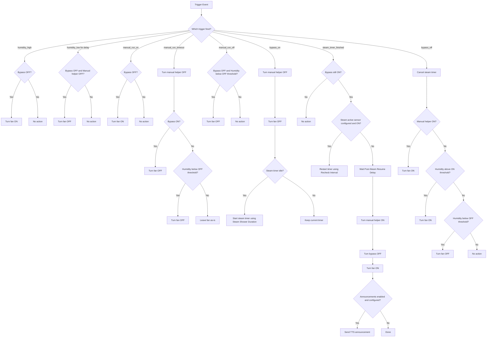

# Bathroom Exhaust Controller Blueprint

## Overview

This blueprint manages a bathroom exhaust fan using humidity, a manual run helper, and a steam-shower bypass mode.

It is designed to:
- Turn the fan on when humidity is high.
- Turn the fan off when humidity is low for a sustained period.
- Support manual run windows with automatic timeout.
- Force the fan off during steam-shower mode.
- Use a timer helper so remaining steam time is visible in the UI.
- Optionally recheck whether steam is still active before resuming normal behavior.
- Optionally announce when steam mode ends and exhaust resumes.

## Flow Chart

## Required Inputs

- Humidity Sensor (`sensor`)
- Exhaust Fan (`fan` or `switch`)
- Manual Run Helper (`input_boolean`)
- Steam Shower Bypass (`input_boolean`)
- Steam Shower Timer (`timer`)

## Optional Inputs

- Steam Still Active Sensor (`binary_sensor` or `input_boolean`)
- Enable Steam-End Announcement (`boolean`)
- TTS Service (`text`)
- Announcement Players (`media_player`, multiple)
- Announcement Message (`text`)

## Thresholds and Timers

- Turn-On Humidity: default `60%`
- Turn-Off Humidity: default `40%`
- Turn-Off Delay: default `10 minutes`
- Manual Run Time: default `40 minutes`
- Steam Shower Duration: default `15 minutes`
- Post-Steam Resume Delay: default `0 minutes`
- Steam Recheck Interval: default `5 minutes`

## Recommended Helper Setup

Create these helpers before using the blueprint:
- `input_boolean` for manual run helper
- `input_boolean` for steam-shower bypass
- `timer` for steam-shower timer
- Optional `binary_sensor` or `input_boolean` for steam-active recheck

## Notes

- Steam-shower mode intentionally forces the fan off.
- When steam mode completes, the blueprint can resume fan operation by turning the manual helper on, turning bypass off, and turning the fan on.
- If the optional steam-active sensor is still on when the timer ends, the timer is restarted instead of resuming.
- Automation mode is `queued` with `max: 10`, which helps process overlapping trigger events in order.
